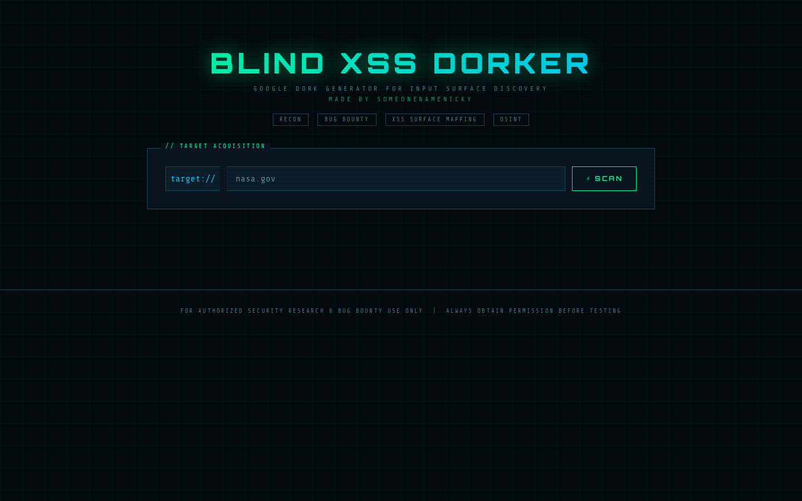

# Blind XSS Dorker


This tool automates Google dork generation for finding potential input points (such as contact forms) on a target domain for blind XSS testing.

## Installation
```bash
git clone https://github.com/nickyqqq/blind-xss-dorker.git
cd blind-xss-dorker
python -m venv venv
source venv/bin/activate
pip install -r requirements.txt
python app.py
```

Access the web app at `http://localhost:5000`.

## Star History

[](https://www.star-history.com/#nickyqqq/blind-xss-dorker&Date)
